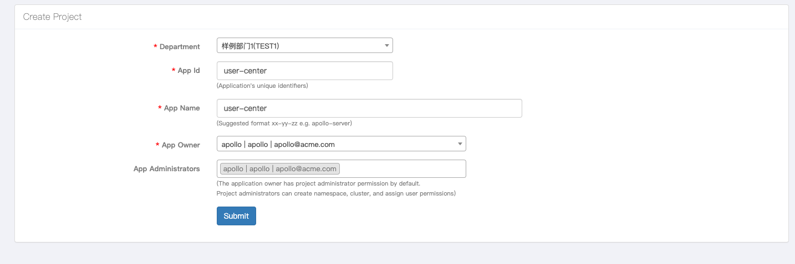
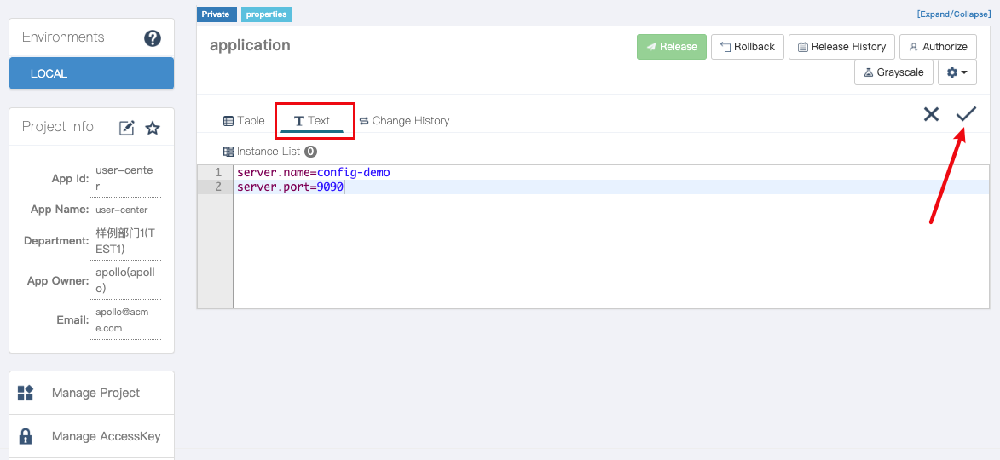
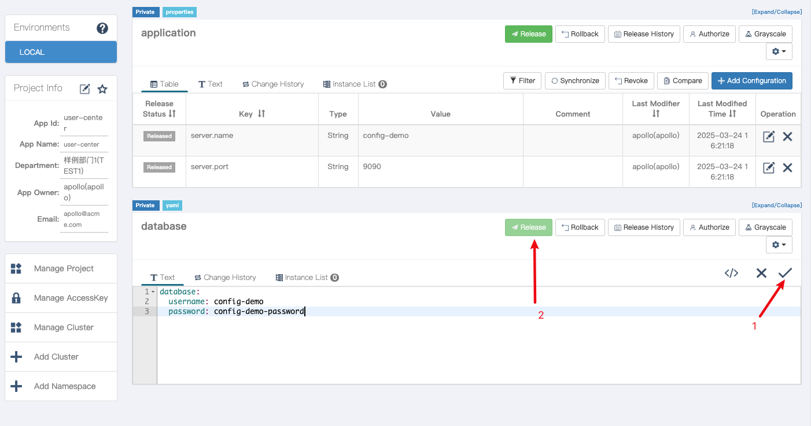

[//]: # (desc: Apollo Configuration Center Example)

<p>
    English&nbsp ｜&nbsp <a href="README_CN.md">中文</a>
</p>

# Apollo Configuration Center Example
- [Apollo Configuration Center Example](#apollo-configuration-center-example)
  - [Prerequisites](#prerequisites)
  - [Quick Start](#quick-start)
    - [1. Start Apollo Service](#1-start-apollo-service)
    - [2. Create Sample Configuration](#2-create-sample-configuration)
    - [3. Run the Example Program](#3-run-the-example-program)
  - [Example Description](#example-description)
    - [Code Example](#code-example)
  - [Configuration File Description](#configuration-file-description)
  - [Directory Structure](#directory-structure)
  - [References](#references)

This example demonstrates how to use the Apollo configuration center component in the Gone framework to implement dynamic configuration retrieval and real-time update functionality.

## Prerequisites

- Go 1.24 or higher
- Docker and Docker Compose (for running Apollo service)

## Quick Start

### 1. Start Apollo Service

This example provides a complete Apollo service environment with all necessary components. You can quickly start the entire environment using Docker Compose:

```bash
# Start Apollo service
docker-compose up -d
```

After the service starts, you can access the Apollo management interface at:
- Portal: http://localhost:8070
- Default username/password: apollo/admin

### 2. Create Sample Configuration

1. Log in to Apollo Portal
2. Create application `user-center` (application ID must match `apollo.appId` in the configuration file)

   

3. Create two namespaces:
   - `application` (default namespace)
   - `database.yaml` (custom namespace, YAML format)

   

   

4. Add the following configuration items in the `application` namespace:
   ```properties
   server.name = config-demo
   server.port = 9090
   ```

5. Add the following configuration items in the `database.yaml` namespace:
   ```yaml
   database:
     username: config-demo
     password: config-demo-password
   ```

   

6. Release the configuration (click the "Release" button)

   

> Tip: This example provides preset configuration files in the `config-files` directory that can be directly imported into Apollo.

### 3. Run the Example Program

```bash
go run main.go
```

The program will output configuration values and refresh every 10 seconds to demonstrate the dynamic update functionality.

## Example Description

This example demonstrates the following features:

1. Basic Configuration Reading
   - Inject configuration using `gone:"config,key"` tag
   - Support basic types (string, int, etc.) and struct types

2. Dynamic Configuration Updates
   - Support dynamic updates for pointer type configuration items
   - Program automatically retrieves the latest values after modifying configurations in Apollo

3. Multi-namespace Support
   - Read configurations from multiple namespaces simultaneously
   - Support different configuration formats (Properties and YAML)

### Code Example

```go
type Database struct {
	UserName string `mapstructure:"username"`
	Pass     string `mapstructure:"password"`
}

func main() {
	gone.
		NewApp(apollo.Load).
		Run(func(params struct {
			serverName string `gone:"config,server.name"`
			serverPort int    `gone:"config,server.port"`

			dbUserName string `gone:"config,database.username"`
			dbUserPass string `gone:"config,database.password"`

			database *Database `gone:"config,database"`

			key string `gone:"config,key.not-existed-in-etcd"`
		}) {
			fmt.Printf("serverName=%s, serverPort=%d, dbUserName=%s, dbUserPass=%s, key=%s\n", params.serverName, params.serverPort, params.dbUserName, params.dbUserPass, params.key)

			for i := 0; i < 10; i++ {
				fmt.Printf("database: %#+v\n", *params.database)
				time.Sleep(10 * time.Second)
			}
		})
}
```

## Configuration File Description

Apollo configuration items in the example (located in `config/default.yaml`):

```yaml
apollo:
  appId: user-center           # Apollo application ID
  cluster: default             # Cluster name
  ip: http://127.0.0.1:8080    # Apollo configuration center address
  namespace: application,database.yaml  # Namespaces (comma-separated for multiple)
  secret: 1ad569dfbf42400385ac1ebd0b5100b0  # Access key
  isBackupConfig: false        # Whether to enable backup configuration
  watch: true                  # Whether to watch for configuration changes
```

## Directory Structure

```
.
├── README.md           # This document
├── config/             # Local configuration file directory
│   └── default.yaml    # Apollo client configuration
├── config-files/       # Preset Apollo configuration files
│   ├── application.properties  # Application configuration (default namespace)
│   └── database.yaml   # Database configuration (custom namespace)
├── docker-compose.yml  # Apollo service Docker compose file
├── images/             # Operation guide screenshots
├── go.mod              # Go module definition
├── main.go             # Example program entry
└── sql/                # Apollo database initialization scripts
```

## References

- [Gone Apollo Component Documentation](https://github.com/gone-io/goner/tree/main/apollo)
- [Apollo Official Documentation](https://www.apolloconfig.com/)
- [Gone Framework Documentation](https://github.com/gone-io/gone)