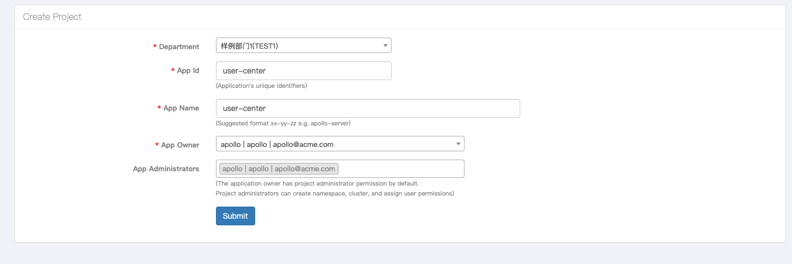
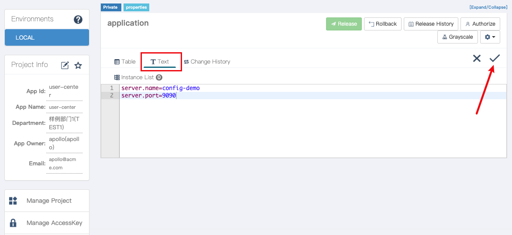
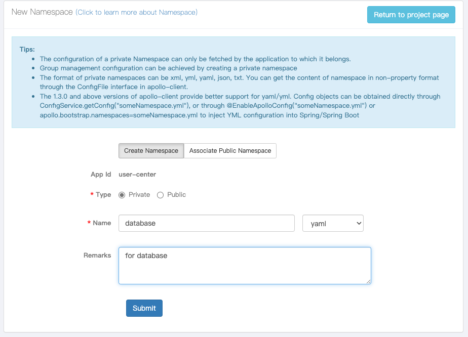
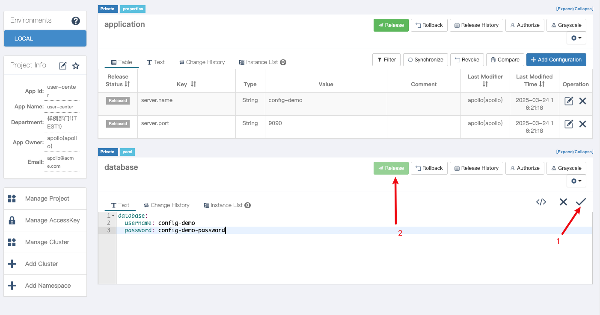
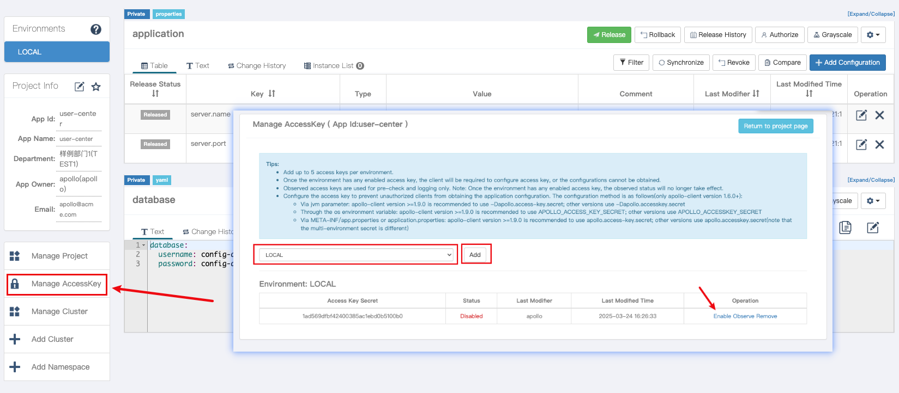

[//]: # (desc: Apollo配置中心示例)

<p>
    <a href="README.md">English</a>&nbsp ｜&nbsp 中文
</p>

# Apollo 配置中心示例
- [Apollo 配置中心示例](#apollo-配置中心示例)
  - [环境要求](#环境要求)
  - [快速开始](#快速开始)
    - [1. 启动Apollo服务](#1-启动apollo服务)
    - [2. 创建示例配置](#2-创建示例配置)
    - [3. 运行示例程序](#3-运行示例程序)
  - [示例说明](#示例说明)
    - [代码示例](#代码示例)
  - [配置文件说明](#配置文件说明)
  - [目录结构](#目录结构)
  - [参考资料](#参考资料)

本示例演示了如何在Gone框架中使用Apollo配置中心组件，实现配置的动态获取和实时更新功能。

## 环境要求

- Go 1.24 或更高版本
- Docker 和 Docker Compose（用于启动Apollo服务）

## 快速开始

### 1. 启动Apollo服务

本示例提供了一个完整的Apollo服务环境，包含了所有必需的组件。使用Docker Compose可以快速启动整个环境：

```bash
# 启动Apollo服务
docker-compose up -d
```

服务启动后，可以通过以下地址访问Apollo管理界面：
- Portal: http://localhost:8070
- 默认用户名/密码: apollo/admin

### 2. 创建示例配置

1. 登录Apollo Portal
2. 创建应用`user-center`（应用ID需与配置文件中的`apollo.appId`一致）

   

3. 创建两个命名空间：
   - `application`（默认命名空间）
   - `database.yaml`（自定义命名空间，YAML格式）

   

   

4. 在`application`命名空间中添加以下配置项：
   ```properties
   server.name = config-demo
   server.port = 9090
   ```

5. 在`database.yaml`命名空间中添加以下配置项：
   ```yaml
   database:
     username: config-demo
     password: config-demo-password
   ```

   

6. 发布配置（点击「发布」按钮）

   

> 提示：本示例在`config-files`目录中提供了预设的配置文件，可以直接导入到Apollo中。

### 3. 运行示例程序

```bash
go run main.go
```

程序将输出配置值，并每10秒刷新一次，以展示配置的动态更新功能。

## 示例说明

本示例演示了以下功能：

1. 基本配置读取
   - 通过`gone:"config,key"` tag注入配置
   - 支持基本类型（string、int等）和结构体类型

2. 配置动态更新
   - 使用指针类型的配置项支持动态更新
   - 修改Apollo中的配置后，程序会自动获取最新值

3. 多命名空间支持
   - 同时从多个命名空间读取配置
   - 支持不同格式的配置（Properties和YAML）

### 代码示例

```go
type Database struct {
	UserName string `mapstructure:"username"`
	Pass     string `mapstructure:"password"`
}

func main() {
	gone.
		NewApp(apollo.Load).
		Run(func(params struct {
			serverName string `gone:"config,server.name"`
			serverPort int    `gone:"config,server.port"`

			dbUserName string `gone:"config,database.username"`
			dbUserPass string `gone:"config,database.password"`

			database *Database `gone:"config,database"`

			key string `gone:"config,key.not-existed-in-etcd"`
		}) {
			fmt.Printf("serverName=%s, serverPort=%d, dbUserName=%s, dbUserPass=%s, key=%s\n", params.serverName, params.serverPort, params.dbUserName, params.dbUserPass, params.key)

			for i := 0; i < 10; i++ {
				fmt.Printf("database: %#+v\n", *params.database)
				time.Sleep(10 * time.Second)
			}
		})
}
```

## 配置文件说明

示例中的Apollo配置项（位于`config/default.yaml`）：

```yaml
apollo:
  appId: user-center           # Apollo应用ID
  cluster: default             # 集群名称
  ip: http://127.0.0.1:8080    # Apollo配置中心地址
  namespace: application,database.yaml  # 命名空间（多个用逗号分隔）
  secret: 1ad569dfbf42400385ac1ebd0b5100b0  # 访问密钥
  isBackupConfig: false        # 是否开启备份配置
  watch: true                  # 是否监听配置变更
```

## 目录结构

```
.
├── README.md           # 本文档
├── config/             # 本地配置文件目录
│   └── default.yaml    # Apollo客户端配置
├── config-files/       # 预设的Apollo配置文件
│   ├── application.properties  # 应用配置（默认命名空间）
│   └── database.yaml   # 数据库配置（自定义命名空间）
├── docker-compose.yml  # Apollo服务Docker编排文件
├── images/             # 操作指南截图
├── go.mod              # Go模块定义
├── main.go             # 示例程序入口
└── sql/                # Apollo数据库初始化脚本
```

## 参考资料

- [Gone Apollo组件文档](https://github.com/gone-io/goner/tree/main/apollo)
- [Apollo官方文档](https://www.apolloconfig.com/)
- [Gone框架文档](https://github.com/gone-io/gone)