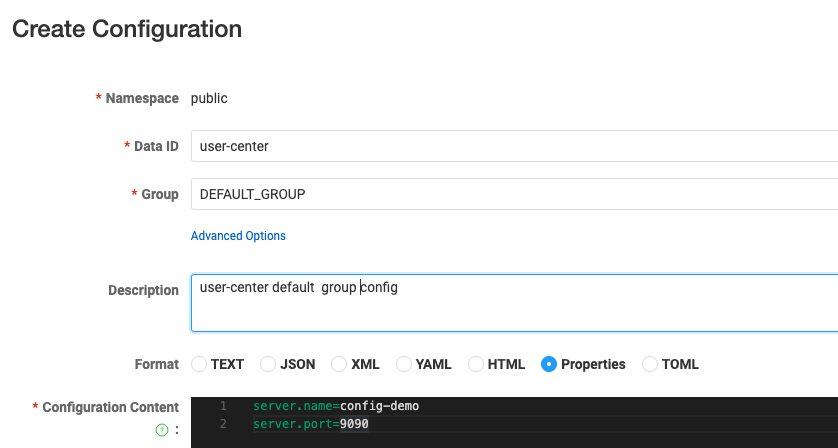
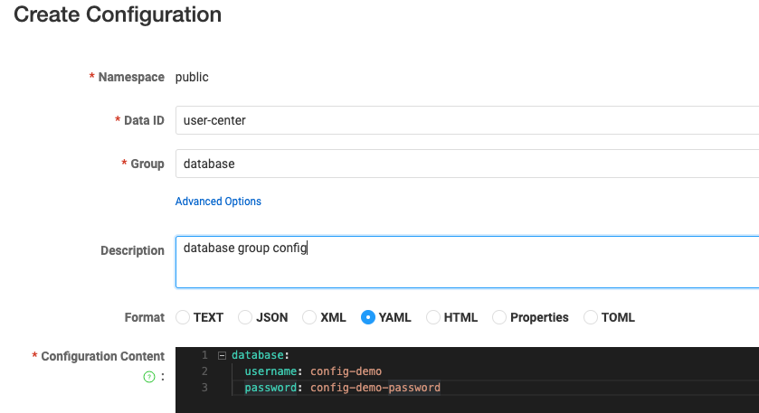

[//]: # (desc: Nacos Configuration Center Example)

<p>
    English&nbsp ｜&nbsp <a href="README_CN.md">中文</a>
</p>

# Gone Framework Nacos Configuration Center Example
- [Gone Framework Nacos Configuration Center Example](#gone-framework-nacos-configuration-center-example)
  - [Project Overview](#project-overview)
  - [Environment Setup](#environment-setup)
    - [Starting Environment](#starting-environment)
    - [Configuring Nacos](#configuring-nacos)
      - [default.yaml Configuration](#defaultyaml-configuration)
  - [Code Implementation](#code-implementation)
    - [Main Code Logic](#main-code-logic)
    - [Configuration Binding](#configuration-binding)
    - [Running the Project](#running-the-project)


## Project Overview

This project demonstrates how to use Nacos as a configuration center in the Gone framework to implement dynamic configuration management. Through the Nacos configuration center, we can:

- Centrally manage application configurations
- Support dynamic configuration updates
- Support multiple configuration formats (JSON, YAML, Properties, TOML, etc.)
- Configuration group management

## Environment Setup

### Starting Environment

The project uses Docker Compose to start the Nacos service. Execute the following command to start:

```bash
docker-compose up -d
```

Nacos service will start on the following ports:
- 8848: HTTP interface port
- 9848: gRPC interface port

### Configuring Nacos

#### default.yaml Configuration
Create a default.yaml file in the project's config directory to configure Nacos client connection information:

```yaml
nacos:
  client:
    namespaceId: public  # Namespace ID
  server:
    ipAddr: "127.0.0.1"  # Nacos server address
    contextPath: /nacos  # Context path
    port: 8848          # Server port
    scheme: http        # Connection protocol
  dataId: user-center   # Configuration file data ID
  watch: true          # Whether to monitor configuration changes
  useLocalConfIfKeyNotExist: true  # Use local configuration when key doesn't exist
  groups:              # Configuration group list
    - group: DEFAULT_GROUP  # Default group
      format: properties   # Configuration format: supports json, yaml, properties, toml
    - group: database      # Database configuration group
      format: yaml        # Configuration format
```

Add the following two configuration files under the default namespace (public):

1. DEFAULT_GROUP.properties - Default group configuration
```properties
server.name=config-demo
server.port=9090
```


2. database.yaml - Database configuration group
```yaml
database:
  username: config-demo
  password: config-demo-password
```



## Code Implementation

### Main Code Logic

The project uses Gone framework's Nacos component to load and manage configurations. The main code implementation is as follows:

```go
func main() {
    gone.
        NewApp(nacos.Load).  // Load Nacos configuration center component
        Run(func(params struct {
            serverName string `gone:"config,server.name"`    // Bind server.name configuration
            serverPort int    `gone:"config,server.port"`    // Bind server.port configuration
            
            dbUserName string `gone:"config,database.username"` // Bind database username
            dbUserPass string `gone:"config,database.password"` // Bind database password
            
            database *Database `gone:"config,database"`  // Bind entire database configuration block
        }) {
            // Use configuration values
            fmt.Printf("serverName=%s, serverPort=%d\n", params.serverName, params.serverPort)
            fmt.Printf("database: %#+v\n", *params.database)
        })
}
```

### Configuration Binding

- Use `gone:"config,key"` tag to mark configuration items
- Support basic types and struct binding
- Support hot configuration updates, configuration changes will automatically update to the application

### Running the Project

1. Ensure Nacos service is started
2. Ensure configurations are imported into Nacos
3. Run the project:
```bash
go run main.go
```

The project will start and output configuration information. When configurations are modified in the Nacos console, the application will automatically retrieve the latest configuration values.