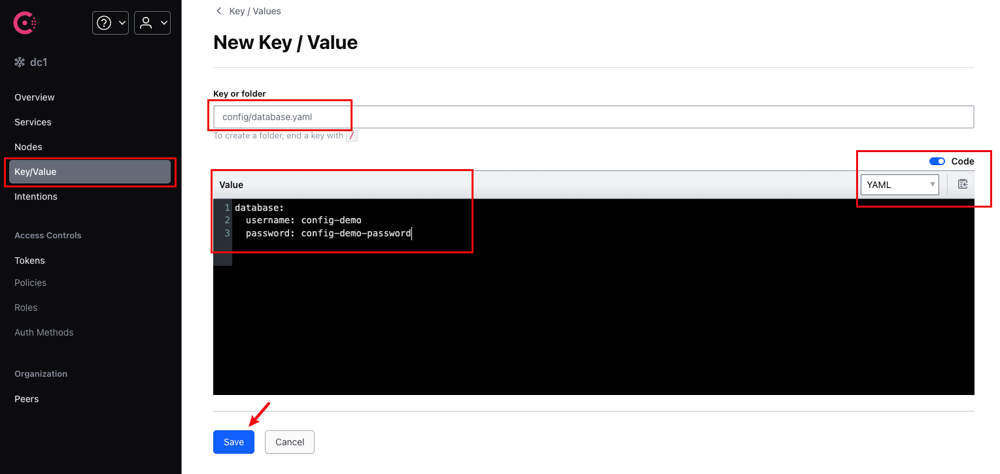

# Consul 配置中心示例
- [Consul 配置中心示例](#consul-配置中心示例)
  - [项目结构](#项目结构)
  - [前置条件](#前置条件)
  - [快速开始](#快速开始)
    - [1. 启动 Consul 服务](#1-启动-consul-服务)
    - [2. 上传配置到 Consul](#2-上传配置到-consul)
    - [3. 运行示例程序](#3-运行示例程序)
  - [配置文件说明](#配置文件说明)
    - [default.yaml](#defaultyaml)
    - [application.yaml](#applicationyaml)
    - [database.yaml](#databaseyaml)
  - [代码示例](#代码示例)
  - [配置变更监听](#配置变更监听)
  - [注意事项](#注意事项)
  - [相关链接](#相关链接)


本示例展示了如何使用 Consul 作为配置中心，通过 Gone 框架的 viper 组件从 Consul 读取配置信息。

## 项目结构

```
.
├── config/                    # 本地配置目录
│   └── default.yaml          # 默认配置文件，包含 Consul 连接信息
├── consul-config-files/      # 将要上传到 Consul 的配置文件
│   ├── application.yaml      # 应用配置
│   └── database.yaml         # 数据库配置
├── docker-compose.yaml       # 用于启动 Consul 服务的 Docker Compose 配置
├── go.mod                    # Go 模块定义
└── main.go                   # 示例程序入口
```

## 前置条件

- 安装 Docker 和 Docker Compose
- 安装 Go 1.16 或更高版本

## 快速开始

### 1. 启动 Consul 服务

使用 Docker Compose 启动 Consul 服务：

```bash
docker-compose up -d
```

这将启动一个 Consul 服务器，并在本地主机上暴露 8500 端口。

### 2. 上传配置到 Consul

访问 Consul UI：http://localhost:8500

在 Consul UI 中，创建以下键值对：

- 键: `config/application.yaml`，值: 复制 `consul-config-files/application.yaml` 的内容


- 键: `config/database.yaml`，值: 复制 `consul-config-files/database.yaml` 的内容



或者，您可以使用 Consul CLI 或 API 上传配置。

### 3. 运行示例程序

```bash
go run main.go
```

## 配置文件说明

### default.yaml

```yaml
viper.remote:
  type: yaml                    # 配置文件类型
  watch: true                   # 是否监听配置变更
  watchDuration: 5s             # 监听间隔
  useLocalConfIfKeyNotExist: true  # 如果远程键不存在，使用本地配置
  providers:
    - provider: consul          # 使用 Consul 作为配置提供者
      configType: yaml          # 配置文件类型
      endpoint: http://localhost:8500  # Consul 服务地址
      path: /config/application.yaml   # 配置路径
      keyring:                  # 密钥环（可选）

    - provider: consul
      configType: yaml
      endpoint: http://localhost:8500
      path: /config/database.yaml
      keyring:
```

### application.yaml

```yaml
# /config/application.yaml

server:
  name: config-demo
  port: 9090
```

### database.yaml

```yaml
# /config/database.yaml

database:
  username: config-demo
  password: config-demo-password
```

## 代码示例

```go
package main

import (
	"fmt"
	"github.com/gone-io/gone/v2"
	"github.com/gone-io/goner/viper/remote"
	"time"
)

type Database struct {
	UserName string `mapstructure:"username"`
	Pass     string `mapstructure:"password"`
}

func main() {
	gone.
		NewApp(remote.Load).  // 使用 remote.Load 加载远程配置
		Run(func(params struct {
			serverName string `gone:"config,server.name"`
			serverPort int    `gone:"config,server.port"`

			dbUserName string `gone:"config,database.username"`
			dbUserPass string `gone:"config,database.password"`

			database *Database `gone:"config,database"`

			key string `gone:"config,key.not-existed-in-etcd"`
		}) {
			fmt.Printf("serverName=%s, serverPort=%d, dbUserName=%s, dbUserPass=%s, key=%s\n", 
				params.serverName, params.serverPort, params.dbUserName, params.dbUserPass, params.key)

			for i := 0; i < 10; i++ {
				fmt.Printf("database: %#+v\n", *params.database)
				time.Sleep(10 * time.Second)
			}
		})
}
```

## 配置变更监听

本示例中启用了配置变更监听功能（`watch: true`），当您在 Consul 中修改配置后，应用程序会自动获取最新的配置值。示例程序每 10 秒打印一次数据库配置，您可以在运行过程中修改 Consul 中的配置，然后观察输出变化。

## 注意事项

1. 确保 Consul 服务正常运行，且能够通过配置的 endpoint 访问。
2. 如果配置中心不可用，且 `useLocalConfIfKeyNotExist` 设置为 true，系统将尝试使用本地配置。
3. 生产环境中，建议配置 Consul 的认证和 TLS。

## 相关链接

- [Gone 框架](https://github.com/gone-io/gone)
- [Goner Viper/remote 组件](../../../viper/remote)
- [Consul 官方文档](https://www.consul.io/docs)