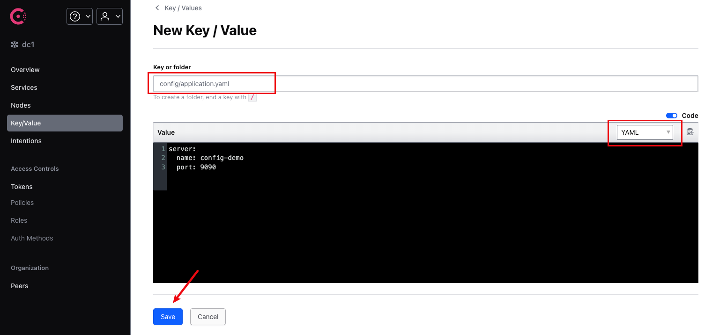
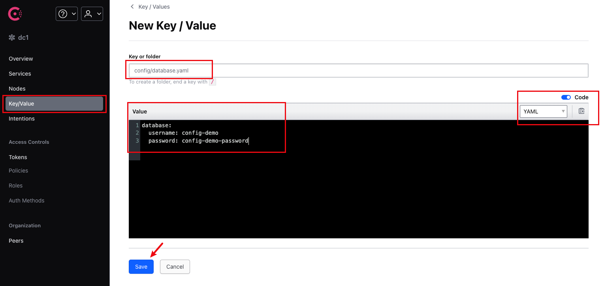

# Consul Configuration Center Example

- [Consul Configuration Center Example](#consul-configuration-center-example)
  - [Project Structure](#project-structure)
  - [Prerequisites](#prerequisites)
  - [Quick Start](#quick-start)
    - [1. Start Consul Service](#1-start-consul-service)
    - [2. Upload Configuration to Consul](#2-upload-configuration-to-consul)
    - [3. Run the Example Program](#3-run-the-example-program)
  - [Configuration File Description](#configuration-file-description)
    - [default.yaml](#defaultyaml)
    - [application.yaml](#applicationyaml)
    - [database.yaml](#databaseyaml)
  - [Code Example](#code-example)
  - [Configuration Change Monitoring](#configuration-change-monitoring)
  - [Notes](#notes)
  - [Related Links](#related-links)


This example demonstrates how to use Consul as a configuration center and read configuration information from Consul using the viper component of the Gone framework.

## Project Structure

```
.
├── config/                    # Local configuration directory
│   └── default.yaml          # Default configuration file, including Consul connection information
├── consul-config-files/      # Configuration files to be uploaded to Consul
│   ├── application.yaml      # Application configuration
│   └── database.yaml         # Database configuration
├── docker-compose.yaml       # Docker Compose configuration for starting Consul service
├── go.mod                    # Go module definition
└── main.go                   # Example program entry
```

## Prerequisites

- Docker and Docker Compose installed
- Go 1.16 or higher installed

## Quick Start

### 1. Start Consul Service

Use Docker Compose to start the Consul service:

```bash
docker-compose up -d
```

This will start a Consul server and expose port 8500 on the local host.

### 2. Upload Configuration to Consul

Access the Consul UI: http://localhost:8500

In the Consul UI, create the following key-value pairs:

- Key: `config/application.yaml`, Value: Copy the content of `consul-config-files/application.yaml`



- Key: `config/database.yaml`, Value: Copy the content of `consul-config-files/database.yaml`




Alternatively, you can use the Consul CLI or API to upload the configuration.

### 3. Run the Example Program

```bash
go run main.go
```

## Configuration File Description

### default.yaml

```yaml
viper.remote:
  type: yaml                    # Configuration file type
  watch: true                   # Whether to listen for configuration changes
  watchDuration: 5s             # Listening interval
  useLocalConfIfKeyNotExist: true  # Use local configuration if remote key does not exist
  providers:
    - provider: consul          # Use Consul as the configuration provider
      configType: yaml          # Configuration file type
      endpoint: http://localhost:8500  # Consul service address
      path: /config/application.yaml   # Configuration path
      keyring:                  # Keyring (optional)

    - provider: consul
      configType: yaml
      endpoint: http://localhost:8500
      path: /config/database.yaml
      keyring:
```

### application.yaml

```yaml
# /config/application.yaml

server:
  name: config-demo
  port: 9090
```

### database.yaml

```yaml
# /config/database.yaml

database:
  username: config-demo
  password: config-demo-password
```

## Code Example

```go
package main

import (
	"fmt"
	"github.com/gone-io/gone/v2"
	"github.com/gone-io/goner/viper/remote"
	"time"
)

type Database struct {
	UserName string `mapstructure:"username"`
	Pass     string `mapstructure:"password"`
}

func main() {
	gone.
		NewApp(remote.Load).  // Use remote.Load to load remote configuration
		Run(func(params struct {
			serverName string `gone:"config,server.name"`
			serverPort int    `gone:"config,server.port"`

			dbUserName string `gone:"config,database.username"`
			dbUserPass string `gone:"config,database.password"`

			database *Database `gone:"config,database"`

			key string `gone:"config,key.not-existed-in-etcd"`
		}) {
			fmt.Printf("serverName=%s, serverPort=%d, dbUserName=%s, dbUserPass=%s, key=%s\n", 
				params.serverName, params.serverPort, params.dbUserName, params.dbUserPass, params.key)

			for i := 0; i < 10; i++ {
				fmt.Printf("database: %#+v\n", *params.database)
				time.Sleep(10 * time.Second)
			}
		})
}
```

## Configuration Change Monitoring

This example enables configuration change monitoring (`watch: true`). When you modify the configuration in Consul, the application will automatically retrieve the latest configuration values. The example program prints the database configuration every 10 seconds, allowing you to observe changes in the output after modifying the Consul configuration during runtime.

## Notes

1. Ensure that the Consul service is running normally and accessible through the configured endpoint.
2. If the configuration center is unavailable and `useLocalConfIfKeyNotExist` is set to true, the system will attempt to use the local configuration.
3. In production environments, it is recommended to configure Consul authentication and TLS.

## Related Links

- [Gone Framework](https://github.com/gone-io/gone)
- [Goner Viper/remote Component](../../../viper/remote)
- [Consul Official Documentation](https://www.consul.io/docs)