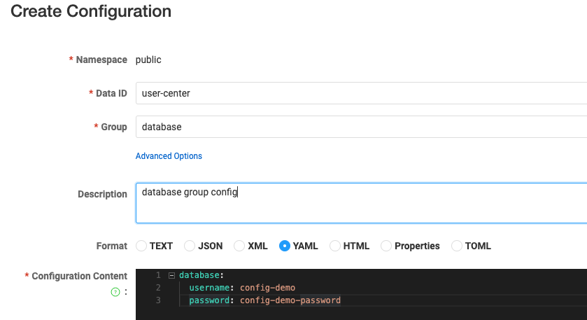

[//]: # (desc: Nacos配置中心示例)

<p>
    <a href="README.md">English</a>&nbsp ｜&nbsp 中文
</p>

# Gone框架 Nacos配置中心示例
- [Gone框架 Nacos配置中心示例](#gone框架-nacos配置中心示例)
  - [项目概述](#项目概述)
  - [环境准备](#环境准备)
    - [启动环境](#启动环境)
    - [配置nacos](#配置nacos)
      - [default.yaml配置](#defaultyaml配置)
  - [代码实现](#代码实现)
    - [主要代码逻辑](#主要代码逻辑)
    - [配置绑定](#配置绑定)
    - [运行项目](#运行项目)


## 项目概述

本项目展示了如何在Gone框架中使用Nacos作为配置中心，实现动态配置管理功能。通过Nacos配置中心，我们可以：

- 集中管理应用配置
- 支持动态配置更新
- 支持多种配置格式（JONS、YAML、Properties、TOML等）
- 配置分组管理

## 环境准备

### 启动环境

项目使用Docker Compose启动Nacos服务，执行以下命令启动：

```bash
docker-compose up -d
```

Nacos服务将在以下端口启动：
- 8848：HTTP接口端口
- 9848：gRPC接口端口

### 配置nacos

#### default.yaml配置
在项目的config目录下创建default.yaml文件，用于配置Nacos客户端连接信息：

```yaml
nacos:
  client:
    namespaceId: public  # 命名空间ID
  server:
    ipAddr: "127.0.0.1"  # Nacos服务器地址
    contextPath: /nacos  # 上下文路径
    port: 8848          # 服务端口
    scheme: http        # 连接协议
  dataId: user-center   # 配置文件的数据ID
  watch: true          # 是否监听配置变更
  useLocalConfIfKeyNotExist: true  # 当配置不存在时是否使用本地配置
  groups:              # 配置分组列表
    - group: DEFAULT_GROUP  # 默认分组
      format: properties   # 配置格式：支持json、yaml、properties、toml
    - group: database      # 数据库配置分组
      format: yaml        # 配置格式
```

在默认的名字空间（public）下增加下面两个配置文件：

1. DEFAULT_GROUP.properties - 默认分组配置
```properties
server.name=config-demo
server.port=9090
```


2. database.yaml - 数据库配置组
```yaml
database:
  username: config-demo
  password: config-demo-password
```



## 代码实现

### 主要代码逻辑

项目使用Gone框架的Nacos组件来加载和管理配置。主要代码实现如下：

```go
func main() {
    gone.
        NewApp(nacos.Load).  // 加载Nacos配置中心组件
        Run(func(params struct {
            serverName string `gone:"config,server.name"`    // 绑定server.name配置
            serverPort int    `gone:"config,server.port"`    // 绑定server.port配置
            
            dbUserName string `gone:"config,database.username"` // 绑定数据库用户名
            dbUserPass string `gone:"config,database.password"` // 绑定数据库密码
            
            database *Database `gone:"config,database"`  // 绑定整个database配置块
        }) {
            // 使用配置值
            fmt.Printf("serverName=%s, serverPort=%d\n", params.serverName, params.serverPort)
            fmt.Printf("database: %#+v\n", *params.database)
        })
}
```

### 配置绑定

- 使用`gone:"config,key"` tag标记配置项
- 支持基本类型和结构体绑定
- 支持配置热更新，配置变更时会自动更新到应用中

### 运行项目

1. 确保Nacos服务已启动
2. 确保配置已导入Nacos
3. 运行项目：
```bash
go run main.go
```

项目将启动并输出配置信息，当在Nacos控制台修改配置时，应用会自动获取最新的配置值。