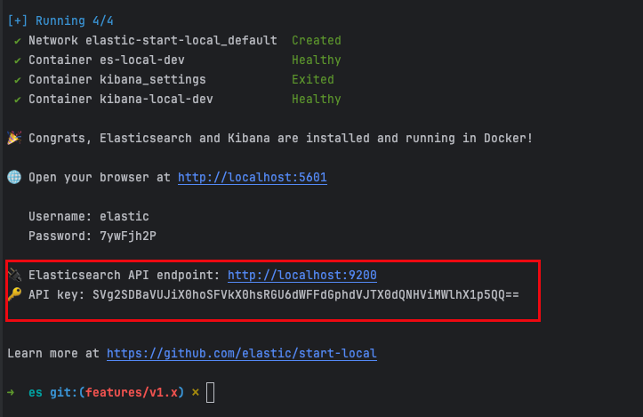

[//]: # (desc: elastic example project)

<p>
    English&nbsp ｜&nbsp <a href="README_CN.md">中文</a>
</p>

# Elasticsearch Example

## Environment Setup

### 1. Local Elasticsearch Deployment

Use the official quick deployment script:

```bash
curl -fsSL https://elastic.co/start-local | sh
```

The script will automatically download and start the latest version of Elasticsearch. Once started, you can access it at http://localhost:9200.

### 2. Configure API Key

1. Access the Elasticsearch console and create an API Key
2. Copy the generated API Key to the configuration file `config/default.yaml`:



Configuration file example:
```yaml
es:
  addresses: http://localhost:9200   # Elasticsearch node address
  aPIKey: "your-api-key-here"      # Replace this with your API Key
```

## Running Examples

This example demonstrates two usage approaches: Low-level API and Fully-typed API.

### 1. Low-level API Example

Run the command:
```bash
go run ./low-level/main.go 
```

Execution result:
```log
2025/03/26 16:22:16 created result: [200 OK] {"acknowledged":true,"shards_acknowledged":true,"index":"my_index"}
2025/03/26 16:22:16 Index result: [201 Created] {"_index":"my_index","_id":"KH6L0ZUBb_HhHUd_hFDu","_version":1,"result":"created","_shards":{"total":2,"successful":1,"failed":0},"_seq_no":0,"_primary_term":1}
2025/03/26 16:22:16 Get result: [200 OK] {"_index":"my_index","_id":"KH6L0ZUBb_HhHUd_hFDu","_version":1,"_seq_no":0,"_primary_term":1,"found":true,"_source":{"name":"go-elasticsearch"}}
2025/03/26 16:22:16 Delete result: [200 OK] {"acknowledged":true}
```

The example demonstrates the following operations:
1. Create an index
2. Add a document
3. Query a document
4. Delete an index

### 2. Fully-typed API Example

Run the command:
```bash
go run ./fully-typed/main.go
```

Execution result:
```log
2025/03/26 16:23:01 created result: &create.Response{Acknowledged:true, Index:"my_index", ShardsAcknowledged:true}
2025/03/26 16:23:01 Index result: &index.Response{ForcedRefresh:(*bool)(nil), Id_:"KX6M0ZUBb_HhHUd_NVAG", Index_:"my_index", PrimaryTerm_:(*int64)(0x1400000f038), Result:result.Result{Name:"created"}, SeqNo_:(*int64)(0x1400000f030), Shards_:types.ShardStatistics{Failed:0x0, Failures:[]types.ShardFailure(nil), Skipped:(*uint)(nil), Successful:0x1, Total:0x2}, Version_:1}
2025/03/26 16:23:01 Get result: &get.Response{Fields:map[string]json.RawMessage{}, Found:true, Id_:"KX6M0ZUBb_HhHUd_NVAG", Ignored_:[]string(nil), Index_:"my_index", PrimaryTerm_:(*int64)(0x140000a2448), Routing_:(*string)(nil), SeqNo_:(*int64)(0x140000a2440), Source_:json.RawMessage{0x7b, 0x22, 0x6e, 0x61, 0x6d, 0x65, 0x22, 0x3a, 0x22, 0x67, 0x6f, 0x2d, 0x65, 0x6c, 0x61, 0x73, 0x74, 0x69, 0x63, 0x73, 0x65, 0x61, 0x72, 0x63, 0x68, 0x22, 0x7d}, Version_:(*int64)(0x140000a2438)}
2025/03/26 16:23:01 Delete result: &delete.Response{Acknowledged:true, Shards_:(*types.ShardStatistics)(nil)}
```

The Fully-typed API provides better type safety and IDE support, recommended for production use.

## Common Issues

1. If you encounter connection issues, please ensure:
   - Elasticsearch service is running properly
   - API Key is configured correctly
   - Firewall is not blocking the relevant ports

2. For more configuration options, please refer to the `es/README.md` documentation.