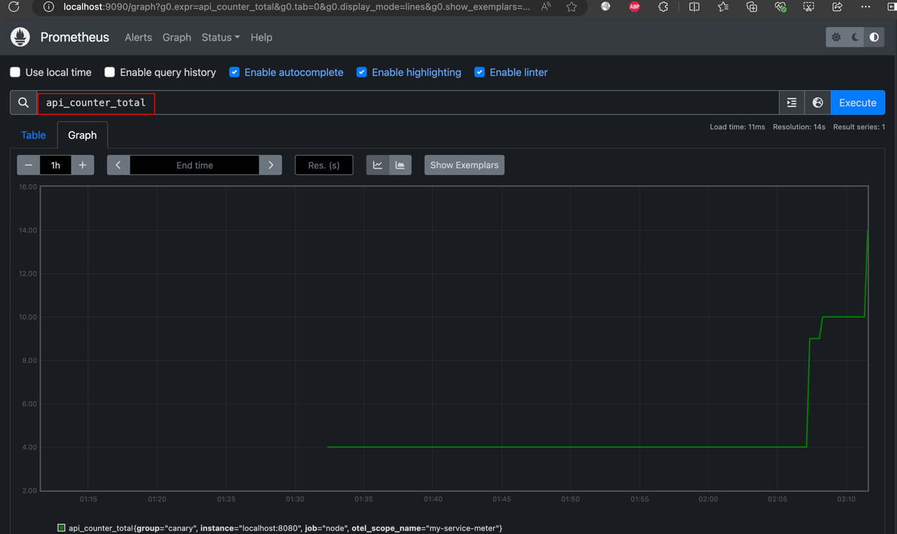

[//]: # (desc: Integrating OpenTelemetry with Prometheus)

<p>
    English&nbsp ｜&nbsp <a href="README_CN.md">中文</a>
</p>


# Integrating OpenTelemetry with Prometheus

This example demonstrates how to integrate OpenTelemetry with Prometheus in the Gone framework to monitor and visualize application metrics.

## Project Setup Steps

### 1. Create Project and Install Dependencies

```bash
# Create project directory
mkdir prometheus
cd prometheus

# Initialize Go module
go mod init examples/otel/prometheus

# Install Gone framework's OpenTelemetry and Prometheus integration components
gonectl install goner/otel/meter/prometheus/gin
```

### 2. Define Metrics: API Access Counter

First, create a controller file:

```bash
mkdir controller
touch controller/ctr.go
```

Then, implement the API counter in `controller/ctr.go`:

```go
package controller

import (
	"github.com/gin-gonic/gin"
	"github.com/gone-io/gone/v2"
	"github.com/gone-io/goner/g"
	"go.opentelemetry.io/otel"
	"go.opentelemetry.io/otel/metric"
)

type ctr struct {
	gone.Flag
	r g.IRoutes `gone:"*"`
}

func (c *ctr) Mount() (err g.MountError) {
	// Create metrics collector
	var meter = otel.Meter("my-service-meter")
	apiCounter, err := meter.Int64Counter(
		"api.counter",
		metric.WithDescription("Number of API calls"),
		metric.WithUnit("{count}"),
	)
	if err != nil {
		return gone.ToErrorWithMsg(err, "Failed to create api.counter")
	}

	// Register route and increment counter on each access
	c.r.GET("/hello", func(ctx *gin.Context) string {
		apiCounter.Add(ctx, 1)
		return "hello, world"
	})
	return
}
```

### 3. Create Service Entry Point

```bash
mkdir cmd
echo """
package main

import (
	"github.com/gone-io/gone/v2"
)

//go:generate gonectl generate -m . -s ..
func main() {
	gone.Serve()
}
""" > cmd/server.go
```

## Running the Service

Execute the following commands to generate dependencies and start the service:

```bash
# Generate dependency code
go generate ./...

# Run the service
go run ./cmd
```

Or use gonectl to run:

```bash
gonectl run ./cmd
```

## Viewing Results

### Access the API Endpoint

```bash
curl http://localhost:9090/hello
```

### View Metrics Data

```bash
curl http://localhost:9090/metrics
```

## Using Prometheus to Collect Data

### 1. Configure and Start Prometheus

- Create Prometheus configuration file:

```bash
echo """
scrape_configs:
  - job_name: 'node'

    # Collect data every 5 seconds
    scrape_interval: 5s

    static_configs:
      - targets: ['localhost:8080']
        labels:
          group: 'canary'
""" > prometheus.yml
```

- Create Docker Compose configuration file:

```bash
echo """
services:
  prometheus:
    image: prom/prometheus
    network_mode: host
#    ports:
#      - "9090:9090"
    volumes:
      - ./prometheus.yml:/etc/prometheus/prometheus.yml
""" > docker-compose.yml
```

- Start Prometheus service:

```bash
docker compose up -d
```

### 2. View Metrics in Prometheus Interface

1. Access Prometheus Web interface: http://localhost:9090/graph
2. Access the API endpoint multiple times: http://localhost:9090/hello
3. Enter in the Prometheus query box: `api_counter_total`

