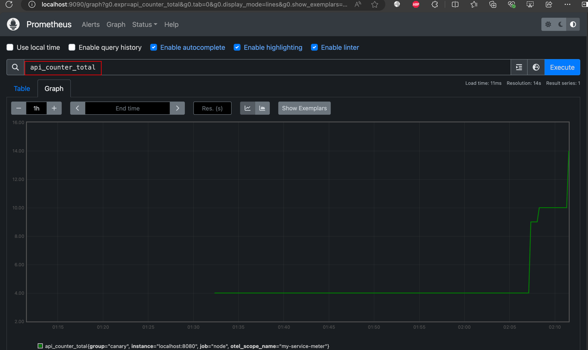

[//]: # (desc: 使用openTelemetry对接prometheus)

<p>
    <a href="README.md">English</a>&nbsp ｜&nbsp 中文
</p>


# 使用OpenTelemetry对接Prometheus

本示例展示如何在Gone框架中集成OpenTelemetry与Prometheus，实现应用指标的监控与可视化。

## 项目构建步骤

### 1. 创建项目和安装依赖包

```bash
# 创建项目目录
mkdir prometheus
cd prometheus

# 初始化Go模块
go mod init examples/otel/prometheus

# 安装Gone框架的OpenTelemetry与Prometheus集成组件
gonectl install goner/otel/meter/prometheus/gin
```

### 2. 定义指标：API访问计数器

首先，创建控制器文件：

```bash
mkdir controller
touch controller/ctr.go
```

然后，在`controller/ctr.go`中实现API计数器：

```go
package controller

import (
	"github.com/gin-gonic/gin"
	"github.com/gone-io/gone/v2"
	"github.com/gone-io/goner/g"
	"go.opentelemetry.io/otel"
	"go.opentelemetry.io/otel/metric"
)

type ctr struct {
	gone.Flag
	r g.IRoutes `gone:"*"`
}

func (c *ctr) Mount() (err g.MountError) {
	// 创建指标收集器
	var meter = otel.Meter("my-service-meter")
	apiCounter, err := meter.Int64Counter(
		"api.counter",
		metric.WithDescription("API调用的次数"),
		metric.WithUnit("{次}"),
	)
	if err != nil {
		return gone.ToErrorWithMsg(err, "创建api.counter失败")
	}

	// 注册路由并在每次访问时增加计数
	c.r.GET("/hello", func(ctx *gin.Context) string {
		apiCounter.Add(ctx, 1)
		return "hello, world"
	})
	return
}
```

### 3. 创建服务入口

```bash
mkdir cmd
echo """
package main

import (
	"github.com/gone-io/gone/v2"
)

//go:generate gonectl generate -m . -s ..
func main() {
	gone.Serve()
}
""" > cmd/server.go
```

## 运行服务

执行以下命令生成依赖并启动服务：

```bash
# 生成依赖代码
go generate ./...

# 运行服务
go run ./cmd
```

或者使用gonectl运行：

```bash
gonectl run ./cmd
```

## 查看结果

### 访问API接口

```bash
curl http://localhost:9090/hello
```

### 查看指标数据

```bash
curl http://localhost:9090/metrics
```

## 使用Prometheus采集数据

### 1. 配置并启动Prometheus

- 创建Prometheus配置文件：

```bash
echo """
scrape_configs:
  - job_name: 'node'

    # 每5秒采集一次数据
    scrape_interval: 5s

    static_configs:
      - targets: ['localhost:8080']
        labels:
          group: 'canary'
""" > prometheus.yml
```

- 创建Docker Compose配置文件：

```bash
echo """
services:
  prometheus:
    image: prom/prometheus
    network_mode: host
#    ports:
#      - "9090:9090"
    volumes:
      - ./prometheus.yml:/etc/prometheus/prometheus.yml
""" > docker-compose.yml
```

- 启动Prometheus服务：

```bash
docker compose up -d
```

### 2. 在Prometheus界面查看指标

1. 访问Prometheus Web界面：http://localhost:9090/graph
2. 多次访问API接口：http://localhost:9090/hello
3. 在Prometheus查询框中输入：`api_counter_total`

