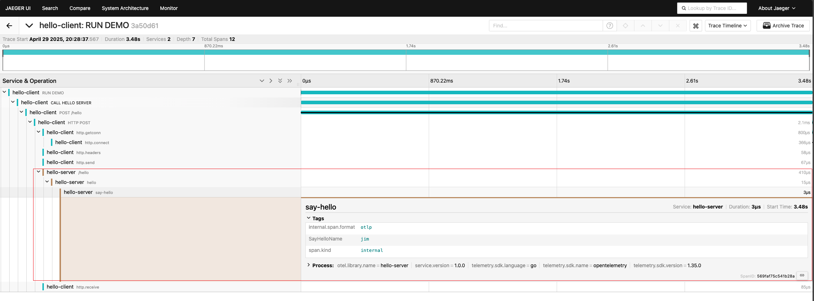

[//]: # (desc: 演示使用goner/gin、goner/urllib、goner/otel/tracer/http + jaeger 做分布式链路追踪 )

<p>
    <a href="README.md">English</a>&nbsp ｜&nbsp 中文
</p>

# 分布式链路追踪示例

本示例演示如何使用 goner/gin、goner/urllib、goner/otel/tracer/http 与 jaeger 实现分布式链路追踪。

## 项目搭建步骤

### 1. 创建服务端

```bash
mkdir server
cd server
go mod init examples/otel/tracer/server
```

创建以下目录结构：

```
server/
  cmd/
    import.gone.go
    server.go
  config/
    default.yaml
  controller/
    ctr.go
    init.gone.go
  init.gone.go
  module.load.go
```

#### 服务端主要文件

- `cmd/server.go` - 服务端入口文件

```go
import (
	"github.com/gone-io/gone/v2"
)

//go:generate gonectr generate -m . -s ..
func main() {
	gone.Serve()
}
```

- `controller/ctr.go` - 控制器实现

```go
import (
	"context"
	"fmt"
	"github.com/gin-gonic/gin"
	"github.com/gone-io/gone/v2"
	"github.com/gone-io/goner/g"
	"go.opentelemetry.io/otel"
	"go.opentelemetry.io/otel/attribute"
)

type ctr struct {
	gone.Flag
	r g.IRoutes `gone:"*"`
}

const tracerName = "hello-server"

func (c *ctr) Mount() (err g.MountError) {
	tracer := otel.Tracer(tracerName)

	c.r.POST("/hello", func(ctx *gin.Context, i struct {
		req struct {
			Name string `json:"name"`
		} `gone:"http,body"`
	}) string {
		x, span := tracer.Start(ctx.Request.Context(), "hello")
		defer span.End()

		return SayHello(x, i.req.Name)
	})
	return
}

func SayHello(context context.Context, name string) string {
	tracer := otel.Tracer(tracerName)
	_, span := tracer.Start(context, "say-hello")
	defer span.End()
	span.SetAttributes(attribute.Key("SayHelloName").String(name))
	return fmt.Sprintf("hello, %s", name)
}
```

- `config/default.yaml` - 服务端配置文件

```yaml
otel:
  service:
    name: "http-hello-server"
  tracer:
    http:
      endpoint: localhost:4318
      insecure: true
```

### 2. 创建客户端

```bash
mkdir client
cd client
go mod init examples/otel/tracer/client
```

创建以下目录结构：

```
client/
  cmd/
    client.go
    import.gone.go
  config/
    default.yaml
  init.gone.go
  module.load.go
```

#### 客户端主要文件

- `cmd/client.go` - 客户端入口文件

```go
import (
	"context"
	"github.com/gone-io/gone/v2"
	"github.com/gone-io/goner/urllib"
	"go.opentelemetry.io/otel"
	"go.opentelemetry.io/otel/codes"
)

const tracerName = "hello-client"

//go:generate gonectr generate -m . -s .. -e client
func main() {
	gone.
		Load(&client{}).
		Run(func(c *client) {
			tracer := otel.Tracer(tracerName)
			ctx, span := tracer.Start(context.Background(), "RUN DEMO")
			defer func() {
				span.End()
			}()

			span.AddEvent("call server")
			c.CallServer(ctx)
		})
}

type client struct {
	gone.Flag
	client urllib.Client `gone:"*"`
	logger gone.Logger   `gone:"*"`
}

func (s *client) CallServer(ctx context.Context) {
	tracer := otel.Tracer(tracerName)
	ctx, span := tracer.Start(ctx, "CALL HELLO SERVER")
	defer span.End()

	var result urllib.Res[string]

	res, err := s.client.R().
		SetBody(map[string]any{
			"name": "jim",
		}).
		SetSuccessResult(&result).
		SetErrorResult(&result).
		SetContext(ctx).
		Post("http://127.0.0.1:8080/hello")

	if err != nil {
		s.logger.Errorf("client request err: %v", err)
		span.SetStatus(codes.Error, "call server failed")
		span.RecordError(err)
		return
	}
	s.logger.Infof("res.httpStatus=>%s", res.Status)
	s.logger.Infof("result=> %#v", result)
}
```

- `config/default.yaml` - 客户端配置文件

```yaml
otel:
  service:
    name: "http-hello-client"
  tracer:
    http:
      endpoint: localhost:4318
      insecure: true
```

## 运行示例

### 1. 启动 Jaeger

使用 Docker 启动 Jaeger 服务：

```bash
make jaeger
```

或者直接运行：

```bash
docker run -d --name jaeger \
  -e COLLECTOR_ZIPKIN_HOST_PORT=:9411 \
  -p 6831:6831/udp \
  -p 6832:6832/udp \
  -p 5778:5778 \
  -p 16686:16686 \
  -p 4317:4317 \
  -p 4318:4318 \
  -p 14250:14250 \
  -p 14268:14268 \
  -p 14269:14269 \
  -p 9411:9411 \
  jaegertracing/all-in-one:1.55
```

### 2. 启动服务端

```bash
make server
```

或者直接运行：

```bash
cd ./server && gonectr run ./cmd
```

### 3. 启动客户端

```bash
make client
```

或者直接运行：

```bash
cd ./client && gonectr run ./cmd
```

## 查看链路追踪结果

1. 打开浏览器访问 Jaeger UI：http://localhost:16686

2. 在 Service 下拉菜单中选择 `hello-client` 或 `hello-server`

3. 点击 "Find Traces" 按钮查看追踪结果

4. 您可以看到完整的调用链路，包括客户端发起请求和服务端处理请求的详细信息


![](./screenshot-2.png


## 项目说明

本示例展示了如何使用 goner/otel/tracer/http 在 Gone 框架中实现分布式链路追踪：

1. 服务端使用 goner/gin 创建 HTTP 服务并集成 OpenTelemetry 追踪
2. 客户端使用 goner/urllib 发送 HTTP 请求并传递追踪上下文
3. 所有追踪数据通过 OTLP 协议发送到 Jaeger 收集器
4. 通过 Jaeger UI 可视化查看完整调用链路

通过这种方式，您可以轻松地在分布式系统中追踪请求的完整生命周期，帮助排查性能问题和系统故障。