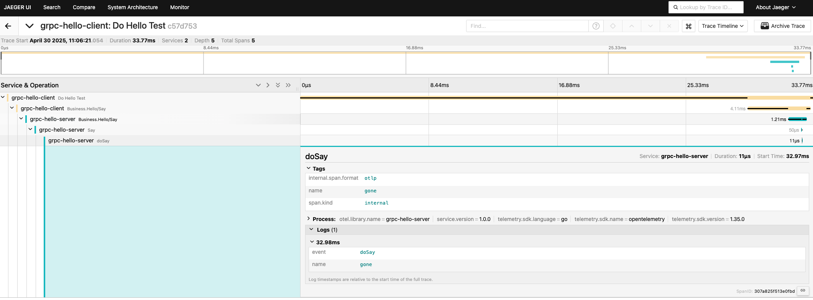

[//]: # (desc: Using OpenTelemetry for Distributed Tracing over gRPC Protocol)

<p>
    English&nbsp ｜&nbsp <a href="README_CN.md">中文</a>
</p>

# Using OpenTelemetry for Distributed Tracing over gRPC Protocol

This example demonstrates how to integrate OpenTelemetry with gRPC in the Gone framework to implement distributed tracing between services.

## Project Setup Steps

### 1. Create Project and Install Dependencies

```bash
# Create project directory
mkdir tracer-over-oltp-grpc
cd tracer-over-oltp-grpc

# Initialize Go module
go mod init examples/otel/tracer-over-oltp-grpc

# Install Gone framework's OpenTelemetry and gRPC integration component
gonectl install goner/otel/tracer/grpc
```

### 2. Define gRPC Service

First, create the proto file:

```bash
mkdir proto
touch proto/hello.proto
```

Define the service interface in `proto/hello.proto`:

```protobuf
syntax = "proto3";

option go_package="/proto";

package Business;

service Hello {
  rpc Say (SayRequest) returns (SayResponse);
}

message SayResponse {
  string Message = 1;
}

message SayRequest {
  string Name = 1;
}
```

### 3. Implement Server

Implement the service in `server/services/hello.go`:

```go
package services

import (
	"context"
	"examples/otel/tracer/oltp/grpc/proto"
	"fmt"
	"github.com/gone-io/gone/v2"
	"go.opentelemetry.io/otel"
	"go.opentelemetry.io/otel/attribute"
	"go.opentelemetry.io/otel/trace"
	"google.golang.org/grpc"
)

type server struct {
	gone.Flag
	proto.UnimplementedHelloServer              // Embed UnimplementedHelloServer
	grpcServer                     *grpc.Server `gone:"*"` // Inject grpc.Server
	logger                         gone.Logger  `gone:"*"`
	tracer                         trace.Tracer
}

const tracerName = "grpc-hello-server"

func (s *server) Init() {
	proto.RegisterHelloServer(s.grpcServer, s) // Register service
	s.tracer = otel.Tracer(tracerName)
}

// Say implements the service defined in the protocol
func (s *server) Say(ctx context.Context, in *proto.SayRequest) (*proto.SayResponse, error) {
	x, span := s.tracer.Start(ctx, "Say")
	defer span.End()

	s.logger.Infof("Received: %v", in.GetName())
	span.SetAttributes(attribute.Key("Name").String(in.GetName()))

	say := s.doSay(x, in.GetName())

	return &proto.SayResponse{Message: say}, nil
}

func (s *server) doSay(ctx context.Context, name string) string {
	_, span := s.tracer.Start(ctx, "doSay")
	defer span.End()

	span.SetAttributes(attribute.Key("name").String(name))
	span.AddEvent("doSay", trace.WithAttributes(attribute.Key("name").String(name)))

	return fmt.Sprintf("Hello, %s!", name)
}
```

## Running the Service

### 1. Start the Server

```bash
# Go to server directory
cd server

# Run the server
go run ./cmd
```

### 2. Start the Client

```bash
# Go to client directory
cd client

# Run the client
go run ./cmd
```

## View Results

After running the service, you can view the trace data through the Jaeger UI:

1. Access the Jaeger UI: http://localhost:16686
2. Select the service name: `grpc-hello-server` in the Search interface
3. Click the Find Traces button to view trace data


You can see the complete call chain, including:
- Client initiating request
- Server receiving request
- Say method execution
- doSay method execution
- Response returning to client

Each span contains detailed attribute information, such as request parameters, execution time, etc.