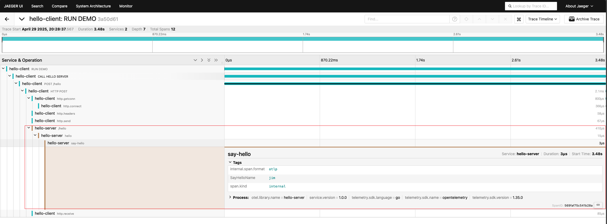
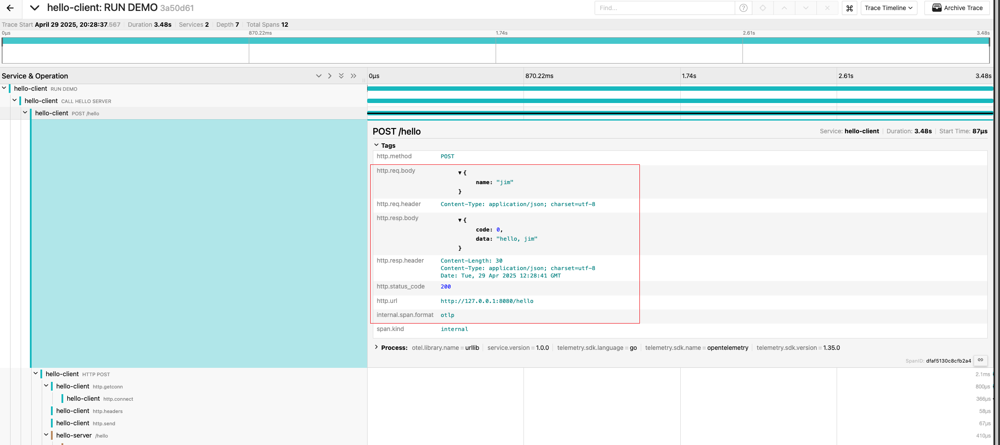

[//]: # (desc: Demonstrate distributed tracing using goner/gin, goner/urllib, goner/otel/tracer/http + jaeger)

<p>
    English&nbsp ｜&nbsp <a href="README_CN.md">中文</a>
</p>

# Distributed Tracing Example

This example demonstrates how to implement distributed tracing using goner/gin, goner/urllib, goner/otel/tracer/http with jaeger.

## Project Setup Steps

### 1. Create Server

```bash
mkdir server
cd server
go mod init examples/otel/tracer/server
```

Create the following directory structure:

```
server/
  cmd/
    import.gone.go
    server.go
  config/
    default.yaml
  controller/
    ctr.go
    init.gone.go
  init.gone.go
  module.load.go
```

#### Server Main Files

- `cmd/server.go` - Server entry file

```go
import (
	"github.com/gone-io/gone/v2"
)

//go:generate gonectl generate -m . -s ..
func main() {
	gone.Serve()
}
```

- `controller/ctr.go` - Controller implementation

```go
import (
	"context"
	"fmt"
	"github.com/gin-gonic/gin"
	"github.com/gone-io/gone/v2"
	"github.com/gone-io/goner/g"
	"go.opentelemetry.io/otel"
	"go.opentelemetry.io/otel/attribute"
)

type ctr struct {
	gone.Flag
	r g.IRoutes `gone:"*"`
}

const tracerName = "hello-server"

func (c *ctr) Mount() (err g.MountError) {
	tracer := otel.Tracer(tracerName)

	c.r.POST("/hello", func(ctx *gin.Context, i struct {
		req struct {
			Name string `json:"name"`
		} `gone:"http,body"`
	}) string {
		x, span := tracer.Start(ctx.Request.Context(), "hello")
		defer span.End()

		return SayHello(x, i.req.Name)
	})
	return
}

func SayHello(context context.Context, name string) string {
	tracer := otel.Tracer(tracerName)
	_, span := tracer.Start(context, "say-hello")
	defer span.End()
	span.SetAttributes(attribute.Key("SayHelloName").String(name))
	return fmt.Sprintf("hello, %s", name)
}
```

- `config/default.yaml` - Server configuration file

```yaml
otel:
  service:
    name: "http-hello-server"
  tracer:
    http:
      endpoint: localhost:4318
      insecure: true
```

### 2. Create Client

```bash
mkdir client
cd client
go mod init examples/otel/tracer/client
```

Create the following directory structure:

```
client/
  cmd/
    client.go
    import.gone.go
  config/
    default.yaml
  init.gone.go
  module.load.go
```

#### Client Main Files

- `cmd/client.go` - Client entry file

```go
import (
	"context"
	"github.com/gone-io/gone/v2"
	"github.com/gone-io/goner/urllib"
	"go.opentelemetry.io/otel"
	"go.opentelemetry.io/otel/codes"
)

const tracerName = "hello-client"

//go:generate gonectl generate -m . -s .. -e client
func main() {
	gone.
		Load(&client{}).
		Run(func(c *client) {
			tracer := otel.Tracer(tracerName)
			ctx, span := tracer.Start(context.Background(), "RUN DEMO")
			defer func() {
				span.End()
			}()

			span.AddEvent("call server")
			c.CallServer(ctx)
		})
}

type client struct {
	gone.Flag
	client urllib.Client `gone:"*"`
	logger gone.Logger   `gone:"*"`
}

func (s *client) CallServer(ctx context.Context) {
	tracer := otel.Tracer(tracerName)
	ctx, span := tracer.Start(ctx, "CALL HELLO SERVER")
	defer span.End()

	var result urllib.Res[string]

	res, err := s.client.R().
		SetBody(map[string]any{
			"name": "jim",
		}).
		SetSuccessResult(&result).
		SetErrorResult(&result).
		SetContext(ctx).
		Post("http://127.0.0.1:8080/hello")

	if err != nil {
		s.logger.Errorf("client request err: %v", err)
		span.SetStatus(codes.Error, "call server failed")
		span.RecordError(err)
		return
	}
	s.logger.Infof("res.httpStatus=>%s", res.Status)
	s.logger.Infof("result=> %#v", result)
}
```

- `config/default.yaml` - Client configuration file

```yaml
otel:
  service:
    name: "http-hello-client"
  tracer:
    http:
      endpoint: localhost:4318
      insecure: true
```

## Running the Example

### 1. Start Jaeger

Start Jaeger service using Docker:

```bash
make jaeger
```

Or run directly:

```bash
docker run -d --name jaeger \
  -e COLLECTOR_ZIPKIN_HOST_PORT=:9411 \
  -p 6831:6831/udp \
  -p 6832:6832/udp \
  -p 5778:5778 \
  -p 16686:16686 \
  -p 4317:4317 \
  -p 4318:4318 \
  -p 14250:14250 \
  -p 14268:14268 \
  -p 14269:14269 \
  -p 9411:9411 \
  jaegertracing/all-in-one:1.55
```

### 2. Start Server

```bash
make server
```

Or run directly:

```bash
cd ./server && gonectl run ./cmd
```

### 3. Start Client

```bash
make client
```

Or run directly:

```bash
cd ./client && gonectl run ./cmd
```

## View Tracing Results

1. Open Jaeger UI in your browser: http://localhost:16686

2. Select `hello-client` or `hello-server` from the Service dropdown menu

3. Click the "Find Traces" button to view the traces

4. You can see the complete call chain, including details of client requests and server processing




## Project Description

This example demonstrates how to implement distributed tracing in the Gone framework using goner/otel/tracer/http:

1. Server uses goner/gin to create HTTP service with integrated OpenTelemetry tracing
2. Client uses goner/urllib to send HTTP requests and propagate tracing context
3. All tracing data is sent to the Jaeger collector via OTLP protocol
4. Complete call chain can be visualized through the Jaeger UI

This approach allows you to easily trace request lifecycles in distributed systems, helping to troubleshoot performance issues and system failures.