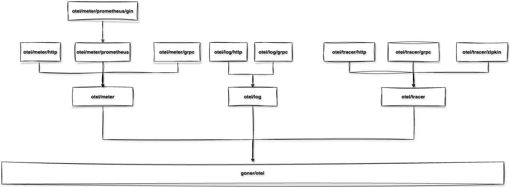

<p>
    English&nbsp ｜&nbsp <a href="README_CN.md">中文</a>
</p>

# goner/otel - OpenTelemetry Support Component for Gone Framework

## Overview
goner/otel is a comprehensive OpenTelemetry integration solution that provides full support for Traces, Metrics, and Logs. This component integrates various export protocols and formats, allowing you to flexibly choose the observability solution that best suits your needs.

## Key Features
- Complete OpenTelemetry protocol support
- Flexible exporter options (HTTP/gRPC)
- Integration with mainstream observability platforms (such as Jaeger, Zipkin, Prometheus)
- Unified configuration management
- Automated context propagation

## Component List

### Core Component
- [goner/otel](.) - Core Component
  - Responsible for setting up **Propagator**
  - Provides unified service configuration management
  - Supports automated context propagation

### Tracing Components
- [goner/otel/tracer](./tracer) - Basic Tracing Component
  - Integrates with OpenTelemetry **Tracer**
  - Provides stdout-based Exporter
  - Supports custom sampling strategies [In Progress...]

- [goner/otel/tracer/http](./tracer/http)
  - Integrates OpenTelemetry OLTP/HTTP protocol
  - Supports exporting trace data to OpenTelemetry Collector

- [goner/otel/tracer/grpc](./tracer/grpc)
  - Integrates OpenTelemetry OLTP/GRPC protocol
  - Provides high-performance gRPC export support

- [goner/otel/tracer/zipkin](./tracer/zipkin)
  - Supports Zipkin format export
  - Compatible with existing Zipkin deployments

### Metrics Components
- [goner/otel/meter](./meter) - Basic Metrics Component
  - Integrates with OpenTelemetry **Meter**
  - Provides stdout-based Exporter
  - Supports various metric types (counters, gauges, histograms, etc.)

- [goner/otel/meter/http](./meter/http)
  - Integrates OpenTelemetry OLTP/HTTP protocol
  - Supports exporting metrics data to OpenTelemetry Collector

- [goner/otel/meter/grpc](./meter/grpc)
  - Supports OpenTelemetry OLTP/GRPC protocol
  - Provides high-performance metrics data transmission

- [goner/otel/meter/prometheus](./meter/prometheus)
  - Supports OpenTelemetry Prometheus `metric.Reader`
  - Provides Prometheus format metrics export

- [goner/otel/meter/prometheus/gin](./meter/prometheus/gin)
  - **Gin** middleware based on **goner/gin** Controller
  - Provides HTTP endpoint for Prometheus metrics scraping

### Logging Components
- [goner/otel/log](./log) - Basic Logging Component
  - Integrates with OpenTelemetry **Log**
  - Supports structured logging

- [goner/otel/log/http](./log/http)
  - Integrates OpenTelemetry OLTP/HTTP protocol
  - Supports exporting logs to OpenTelemetry Collector

- [goner/otel/log/grpc](./log/grpc)
  - Integrates OpenTelemetry OLTP/GRPC protocol
  - Provides high-performance log transmission

## Component Dependencies


## Quick Start
> The following example demonstrates how to send OpenTelemetry data to Jaeger service using OLTP/HTTP protocol.
> Complete example code is available at: [quick-start](../examples/otel/tracer/quick-start)

### 1. Create Application
Create a sample application using gonectl:
```shell
gonectl create -t otel/tracer/quick-start quick-start
cd quick-start
go mod tidy
```

### 2. Start Jaeger Service
Start Jaeger All-in-One service using Docker:
```bash
docker run -d --name jaeger \
  -e COLLECTOR_ZIPKIN_HOST_PORT=:9411 \
  -p 6831:6831/udp \
  -p 6832:6832/udp \
  -p 5778:5778 \
  -p 16686:16686 \
  -p 4317:4317 \
  -p 4318:4318 \
  -p 14250:14250 \
  -p 14268:14268 \
  -p 14269:14269 \
  -p 9411:9411 \
  jaegertracing/all-in-one:1.55
```

### 3. Run Application
Choose either of the following methods to run the application:

Using gonectl:
```bash
gonectl run ./cmd
```

Or using standard Go commands:
```bash
go generate ./...
go run ./cmd
```

### 4. View Trace Data
After startup, access the Jaeger UI:
- Open browser and visit: http://localhost:16686
- Select service and view trace data

## Configuration
Each component supports customization through configuration files. For detailed configuration instructions, please refer to the documentation of each submodule.

## Best Practices
- Recommended to use OpenTelemetry Collector in production environments
- Choose appropriate sampling strategies based on actual needs
- Configure export intervals and batch sizes reasonably
- Be mindful of performance overhead, avoid over-collection